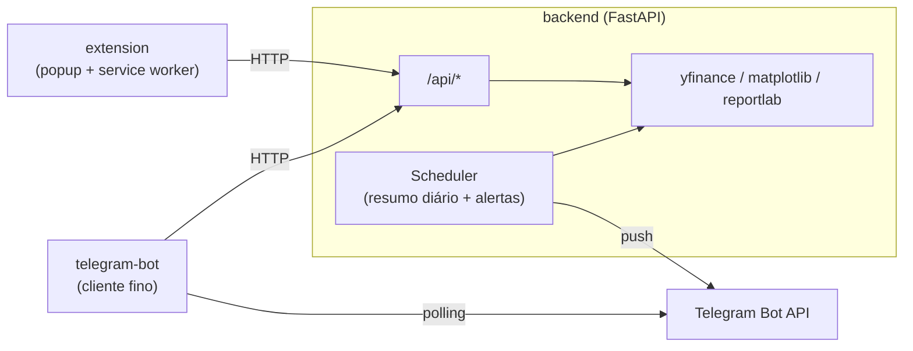

# BotEconomy Suite

Evolução do BotEconomy original: o bot de Telegram continua existindo, mas a lógica de mercado
agora vive num **backend compartilhado**, e ganhou um **companion de navegador** (extensão
Chrome/Edge) como segunda porta de entrada para os mesmos dados.

```
.
├── backend/             # FastAPI: única fonte de dados, usada pelo bot e pela extensão
│   ├── app/
│   ├── tests/
│   ├── Dockerfile
│   └── .env             # config real (não versionado) — único arquivo de env de todo o stack
├── telegram-bot/        # bot do Telegram, agora um cliente fino da API
│   ├── tests/
│   └── Dockerfile
├── extension/           # extensão de navegador (Manifest V3) — o companion (roda no browser, sem Docker)
├── .github/workflows/   # CI: lint + testes + build das imagens Docker
├── docker-compose.yml   # sobe backend + telegram-bot juntos, já plugados um no outro
└── README.md
```

## Por que separar em backend + 2 clientes?

O `main.py` original (removido nesta branch — a lógica foi toda para `backend/` e
`telegram-bot/`) fazia tudo num arquivo só: baixava dados do yfinance, gerava gráficos,
montava PDF e respondia comandos do Telegram — tudo junto. Isso trava a possibilidade de ter um
segundo cliente (a extensão) sem duplicar toda a lógica de mercado em JavaScript. A correção foi
extrair essa lógica para um **backend HTTP** (`backend/`), que os dois clientes consultam:



Isso também corrigiu bugs do projeto original:

| Problema no `main.py` original | Correção |
|---|---|
| `ApplicationBuilder().token()` sem token — o bot não iniciava | Token lido de `TELEGRAM_BOT_TOKEN` (env var) |
| Notícias "extraídas" de um HTML **fixo no código** (não eram reais) | `GET /api/news` faz scraping best-effort real do Yahoo Finance, com fallback vazio se o layout mudar |
| README prometia alertas de preço e resumos às 6h/20h, mas nada disso existia no código | Implementado em `backend/app/scheduler.py` com APScheduler |
| Lista de tickers só existia em memória (reiniciar o bot resetava tudo) | Persistida em `backend/data/state.json`, compartilhada entre bot e extensão |
| Toda cotação exigia rodar Python — impossível ter uma extensão de navegador | Extensão fala HTTP puro com o backend, sem precisar de yfinance no navegador |

## Rodando tudo com Docker (recomendado)

`backend` e `telegram-bot` sobem juntos com um comando só, já conectados um ao outro pela rede
interna do Compose (o bot fala com `http://backend:8000`, não `localhost`). Os dois leem a
**mesma** `backend/.env` — um único lugar pra configurar tudo.

```bash
cp backend/.env.example backend/.env   # preencha TELEGRAM_BOT_TOKEN e TELEGRAM_CHAT_ID
docker compose up --build -d
docker compose logs -f                 # acompanhar os dois serviços
```

O backend só é considerado "de pé" (`service_healthy`) depois que `GET /api/health` responde —
o `telegram-bot` espera isso antes de iniciar, então não há corrida de inicialização. O estado
(`state.json` com tickers/alertas) fica num volume nomeado (`backend_data`), sobrevive a
`docker compose down` / rebuilds.

```bash
docker compose down          # para tudo, mantém o volume de dados
docker compose down -v       # para tudo e apaga o estado (tickers/alertas voltam ao padrão)
docker compose up --build -d # depois de alterar código, reconstrói e sobe de novo
```

A extensão **não** entra no Compose — ela roda no navegador do usuário, fora do controle do
Docker; continue instalando via "carregar sem compactação" (seção 3 abaixo), apontando pra
`http://localhost:8000` (a porta do backend já sai mapeada pro host pelo `docker-compose.yml`).

## Componentes (rodando sem Docker, manualmente)

### 1. `backend/` — API compartilhada
FastAPI + yfinance + matplotlib + reportlab. Expõe:

| Endpoint | Descrição |
|---|---|
| `GET /api/summary` | Top altas/quedas/mais rentáveis do dia |
| `GET /api/volume` | Volume negociado por ticker |
| `GET /api/quote/{ticker}` | Última cotação de um ticker |
| `GET /api/news?ticker=` | Notícias recentes (best-effort) |
| `GET /api/tickers` / `POST` / `DELETE /{ticker}` | Gerenciar a lista monitorada |
| `GET /api/alerts` / `POST` / `DELETE /{id}` | Alertas de preço (`above`/`below`) |
| `GET /api/report` | Gera e baixa o relatório em PDF |

Um `BackgroundScheduler` roda dentro do próprio backend para o resumo diário (06h/20h, configurável)
e para checar alertas de preço, enviando push para o Telegram quando disparam.

**Rodando localmente:**
```bash
cd backend
python -m venv .venv && source .venv/bin/activate
pip install -r requirements.txt
cp .env.example .env   # preencha TELEGRAM_BOT_TOKEN e TELEGRAM_CHAT_ID
uvicorn app.main:app --reload
```

### 2. `telegram-bot/` — o bot original, agora um cliente fino
Mantém os comandos (`/dados`, `/volume`, `/relatorio`, `/addticker`, `/removeticker`,
`/listtickers`) e ganha `/alerta <TICKER> <acima|abaixo> <preço>`. Toda a lógica pesada foi para o
backend; o bot só formata mensagens do Telegram.

```bash
cd telegram-bot
pip install -r requirements.txt
export TELEGRAM_BOT_TOKEN=xxxx
export BOTECONOMY_API_URL=http://localhost:8000
python bot.py
```

### 3. `extension/` — o companion (Chrome / Edge / Brave, Manifest V3)
Um popup com três abas (Mercado, Ações, Alertas), um badge no ícone com a maior alta do dia, e
notificações do navegador quando um alerta de preço dispara. Fala diretamente com o mesmo backend
— nenhuma lógica de mercado é duplicada em JavaScript.

**Instalar sem loja (modo desenvolvedor):**
1. Suba o backend (`uvicorn app.main:app`).
2. Abra `chrome://extensions`, ative "Modo do desenvolvedor".
3. "Carregar sem compactação" → selecione a pasta `extension/`.
4. Clique no ícone da extensão → **Configurações** → informe a URL do backend
   (ex.: `http://localhost:8000`) e salve. A extensão pede permissão de host para essa origem
   dinamicamente (Manifest V3 não permite `host_permissions` fixo para uma URL que só existe em
   tempo de execução).

Estrutura:
```
extension/
├── manifest.json     # MV3, permissões mínimas (host_permissions concedidos sob demanda)
├── background.js     # service worker: alarms (polling) + notifications
├── popup.html/js/css # UI principal
├── options.html/js   # URL do backend, API key, intervalo de atualização
├── config.js         # storage + fetch helpers compartilhados entre popup e background
└── icons/
```

## Testes e CI

`.github/workflows/ci.yml` roda em todo push/PR: lint (`ruff`) + testes (`pytest`) do backend e do
telegram-bot, validação do `manifest.json`/sintaxe JS da extensão, e build dos dois `Dockerfile`
(garante que a imagem sempre builda, mesmo sem publicar).

Rodando localmente:
```bash
# backend
cd backend
pip install -r requirements-dev.txt
ruff check app tests
pytest -v

# telegram-bot
cd ../telegram-bot
pip install -r requirements-dev.txt
ruff check bot.py tests
pytest -v
```

Os testes do backend usam um `state.json` temporário por teste (nunca tocam
`backend/data/state.json` real) e mockam `yfinance` — não fazem chamada de rede nem dependem do
Yahoo estar disponível. Os testes do bot mockam o `ApplicationBuilder` do `python-telegram-bot` —
não conectam no Telegram de verdade.

## Variáveis de ambiente (backend)

| Variável | Uso |
|---|---|
| `TELEGRAM_BOT_TOKEN` / `TELEGRAM_CHAT_ID` | Envio de resumos diários e alertas para o Telegram |
| `ALLOWED_ORIGINS` | Origens com permissão de CORS (inclua `chrome-extension://<id>` em produção) |
| `BOTECONOMY_API_KEY` | Se definido, exige header `X-API-Key` nos endpoints de escrita |
| `MORNING_SUMMARY_HOUR` / `EVENING_SUMMARY_HOUR` | Horário dos resumos diários (padrão 6/20) |
| `ALERT_CHECK_MINUTES` | Frequência de checagem dos alertas de preço (padrão 15min) |

## Roadmap

- [ ] Autenticação de verdade (o `BOTECONOMY_API_KEY` atual é um shared secret simples)
- [ ] Publicar a extensão na Chrome Web Store (hoje é "carregar sem compactação")
- [ ] Suporte a criptomoedas, além dos tickers de ações
- [ ] Dashboard web (o mesmo backend já serve os dados; falta um frontend dedicado)
- [ ] Notícias reais por RSS/API oficial em vez de scraping best-effort

## Licença

MIT — ver [`LICENSE`](LICENSE).
